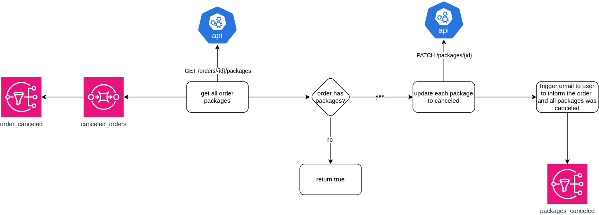
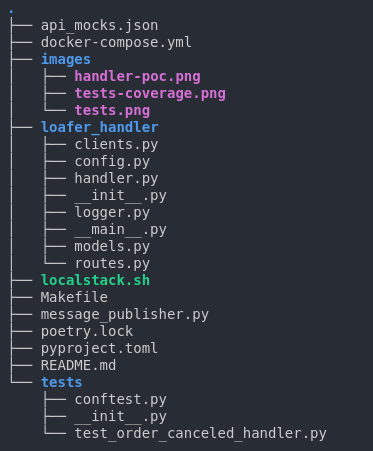
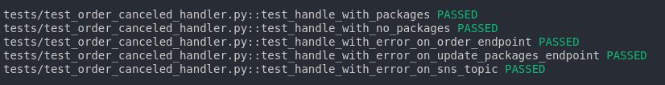
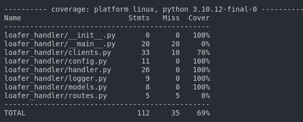

# Simple Message Handler

It is what it is! A simple message handler using Loafer package to practice some skills :smile:

---

## :hammer: Requirements

- Python
- Poetry
- Docker/Docker Compose

## :mag: Context

In order to represent a problem to solve, there was a context that was thought and it uses SNS/SQS topics and queues, external API calls, error handling and monitoring.

### Diagram



### Assets

- **SNS topics:** `order_canceled`, `package_canceled` using *Localstack*;
- **SQS queues:** `canceled_orders` using *Localstack*;
- **API:** mocked API using *Mockoon* to do some sample external HTTP calls.

### Structure



## Install and run locally

To list all `Makefile` commands:

```bash
make list-commands
```

Install the project

```bash
poetry install && poetry shell
```

Start Localstack and Mockoon:

```bash
make dep-start
```

Publish sample message:

```bash
make publish-sample
```

Run handler:

```bash
make run
```

## :bar_chart: Testing

To run `pytest` tests:

```bash
make test
```

### All tests



### Code coverage



---

Made for studies :books: purposes by RafaelEmery

