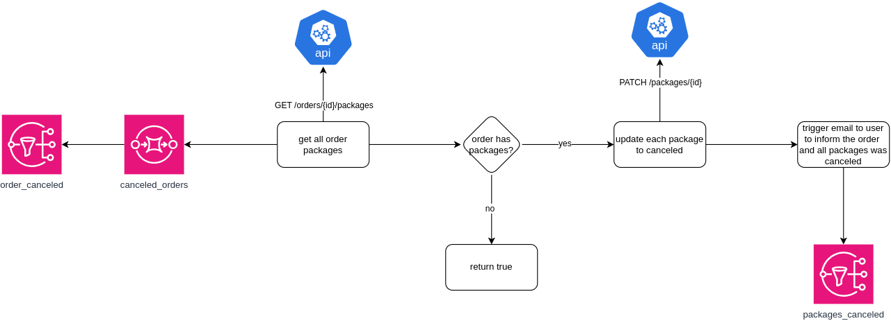

# Simple Message Handler

It is what it is! A simple message handler using Loafer package to practice some skills :smile:

---

## Requirements

## Context

In order to represent a problem to solve, there was a context that was thought and it uses SNS/SQS topics and queues, external API calls, error handling and monitoring.

### Diagram

### Assets

- **SNS topics:** `order_canceled`, `package_canceled`;
- **SQS queues:** `canceled_orders`;
- **API:** mocked API using *Mockoon* to do some sample external HTTP calls.

## Structure

## Install and run locally

## Results

---

Made for studies :books: purposes by RafaelEmery

